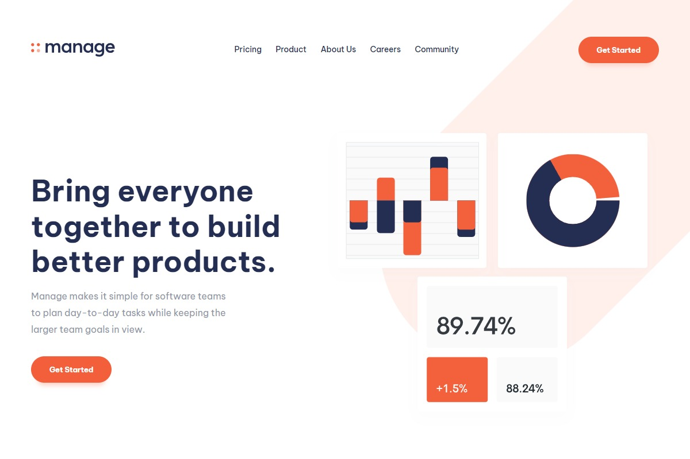

# Dashboard Project using Pug, Sass, JavaScript, and Gulp.js

## Describtion

Simple Respoinsive Landing page using pure html, css & javascript.

## Links

- [Style Link](https://www.frontendmentor.io/challenges/manage-landing-page-SLXqC6P5) - I have implemented on this challenge from frontend mentor.
- [Live Site](https://mohammed-beltagy.github.io/Manage-landing-page/) - Engage with the interactive features of this website and experience its full functionality.
- [Portfolio](https://beltagy.netlify.app) - Discover impressive projects with seamless functionality, and meticulous attention to detail.

Thank you for taking the time to check out my project. If you have any questions or would like to discuss potential opportunities, please feel free to contact me.
